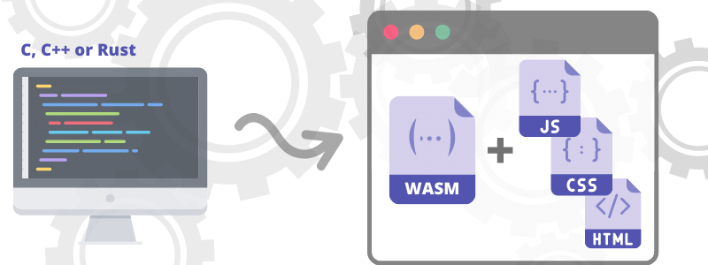
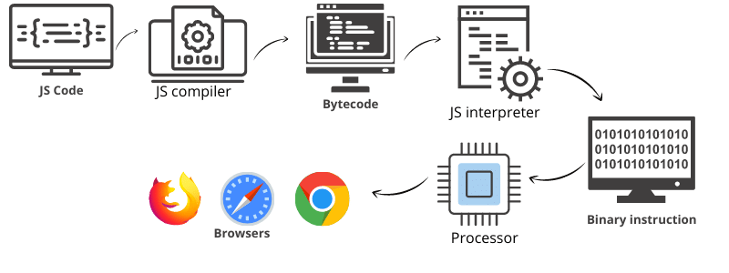
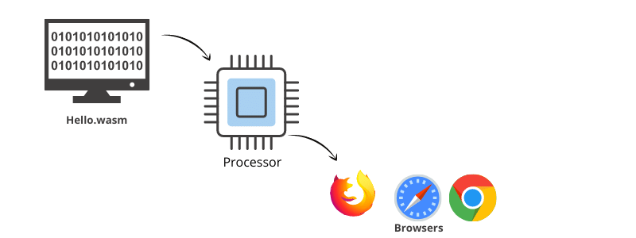
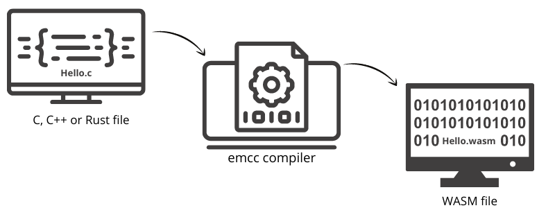
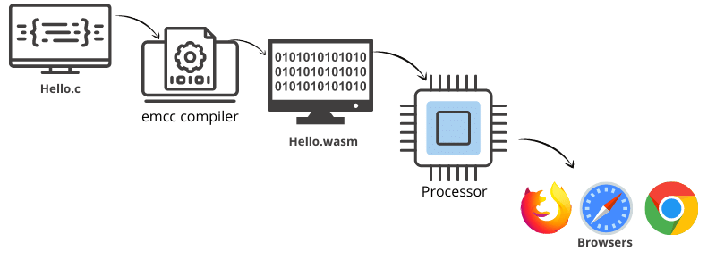

# What is WebAssembly?


WebAssembly is a binary instruction format for a stack-based virtual machine and usually abbreviated as WASM and it is designed as a portable target for compilation of high-level languages like C/C++/Rust, enabling deployment on the web for client and server applications.
</br>

Also in other words we can say that it is a compliment to JavaScript and a way for people to take C++, or C, or rust code,  or any other statically typed language and compile it down  to a module that we can call from JavaScript. So they work together.


## Why do we need WebAssembly?

As we know that JavaScript has been the primary language that runs within the virtual machine. However, modern use-cases have illustrated one of the biggest problems with JavaScript
which is ` performance ` When running resource-intensive apps, such as 3D games, VR and augmented reality, and video editing, we see JavaScript `isn’t` capable of  delivering near-native performance.

Although WebAssembly is completely different from JavaScript and it runs alongside it. This way, developers can get a best-of-both-worlds for their applications. And, unlike JavaScript,
WebAssembly is a low-level, assembly-like language with a compact binary format. This makes it possible for WebAssembly to deliver `near-native` performance.

> With more and more cloud native, mobile-first development going on, near-native performance has become crucial for some applications to function in a way that is viable to consumers.

<h4> Here are some benefits which shows why we need WebAssembly</h4>

- <h5>WebAssembly is efficient and fast :</h5>
   Wasm bytecode is designed to be encoded in a size and load-time-efficient binary format. WebAssembly aims to execute at native speed by taking advantage of common hardware capabilities available on a wide range of platforms.

- <h5>WebAssembly is safe :</h5>
   WebAssembly describes a memory-safe, sandboxed execution environment that may even be implemented inside existing JavaScript virtual machines. When embedded in the web, WebAssembly will enforce the same-origin and permissions security policies of the browser.


- <h5>WebAssembly is open and debuggable : </h5>
   WebAssembly is designed to be pretty-printed in a textual format for debugging, testing, experimenting, optimizing, learning, teaching, and writing programs by hand. The textual format will be used when viewing the source of wasm modules on the web.

- <h5>WebAssembly is part of the open web platform : </h5>
   WebAssembly is designed to maintain the versionless, feature-tested, and backwards-compatible nature of the web. WebAssembly modules will be able to call into and out of the JavaScript context and access browser functionality through the same Web APIs accessible from JavaScript. WebAssembly also supports non-web embeddings.


## Prerequisites of WebAssembly

We Should have a basic understanding of JavaScript and at least one of the high level languages like C, C++ or Rust.


## How Web Assembly Works ?
In order to understand how WebAssembly works we need to understand how JavaScript works.


### How JavaScript works


First of all,  the engine passes the JavaScript code through a parser then the parser goes through the code line by line and checks if code syntax and its type is valid. If everything is valid then the   ` Parser ` creates
an Abstract Syntax Tree.

Then the engine interpreter takes the AST and turns it into Bytecode and finally the engine compiler takes the Bytecode and turns it into a code a machine can run on its processor.


<h5>How WASM Works</h5>



The reason WASM is faster is because WASM code goes directly to the compiler, effectively skipping a few steps such as parsing and the transformation to Intermediate Representation as seen in flow diagram.





The reason why `WASM` is able to skip steps is because JavaScript is a dynamically-typed language, which means that JavaScript checks the type of variables at run-time by the Parser.

In contrast, statically-typed languages such as C/C++ require to declare the types in advance, therefore types are known and are checked at compile time.


>So the way WASM works is:



- We write code with its types, usually in a statically typed-language such as C/C++, or Rust.
- Then we generate a pre-compiled WASM module.
- Then we can run this code straight by the engine compiler, skipping the parsing and the transformation to Intermediate Representation.

### Installation

To compile statically-typed language such as C/C++ we need to install Emscripten SDK which is a Low level virtual machine.

The steps to install Emscripten are as such:

- Clone the repository using command </br>
   ```
   git clone https://github.com/emscripten-core/emsdk.git
   ```
- Navigate to the `emsdk` directory </br>
  ```
  cd emsdk
  ```
- make sure clones repository is updated with remote one: </br>
  ```
  git pull
  ```
- Install the latest version of Emscripten </br>
  ```
  ./emsdk install latest
  ```
- Activate the latest version </br>
  ```
  ./emsdk activate latest
  ```
- Set the various environmental variables </br>
  ```
  source ./emsdk_env.sh
  ```

- Check Installation </br>
  ```
  emcc --version
  ```

- To Compile C/C++ programs </br>
  ```
  emcc hello.c -s WASM=1 -o hello.html    
  em++ hello.cpp -s WASM=1 -o hello.html    
  ```

- For only  wasm file </br>
  ```
  emcc hello.c -s STANDALONE_WASM
  em++ hello.cpp -s STANDALONE_WASM
  ```
## Serving compiled code
There are many way to serve custom or default generated `html` page using Emscripten
- emrun:  </br>
`emrun` is a command line tool inbuild in Emscripten used to launch Emscripten-generated HTML page in a web browser from the command line.
- Using Node server </br>
Start a server using node server
- Starting own server </br>
  - Starting an Apache server
  - Starting a simple server via command line utility provided in  `Python` i.e. `python -m http.server`
  - etc.


## Examples

- [Printing hello using default template, generated while compiling with Emscripten (emcc)](./helloAjay)

- [Calling C function from JavaScript](./callingCprogramsFunction)

- [optimization and error handling](./optimizationAndErrorHandling)

- [Wasm for None-browser (Wasm outside browser) i.e. Running WASM in Terminal]()
