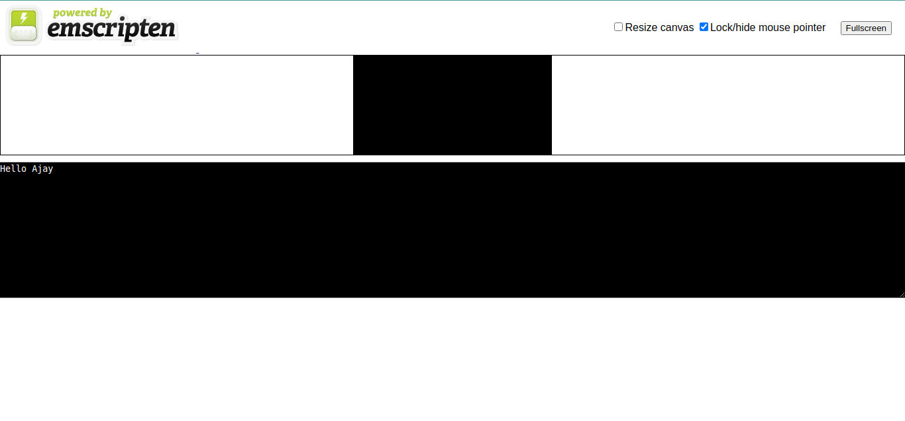

### Steps to launch Emscripten-generated HTML page

- Write C/C++ program
- Compile program usin command </br>
```
emcc hello.c -s WASM=1 -o index.html
```
This will generate three files. A `HTML` file to show our content, `wasm` file which will content our logic written in C/C++ and a `JS` file which will help us to load that `wasm` file into the browser.


- Serve Emscripten HTML page</br>
```
emrun --no_browser --port 8080 index.html
```

This will start a `http server` at localhost port 8080 `http://0.0.0.0:8080/`

- Result </br>


