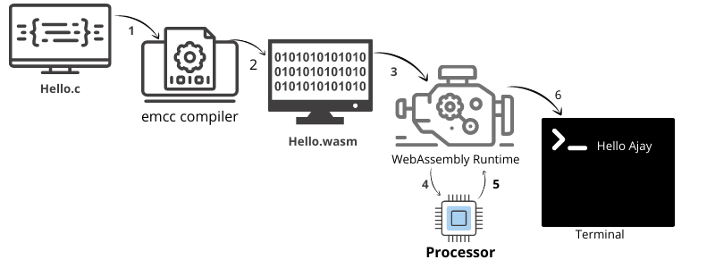
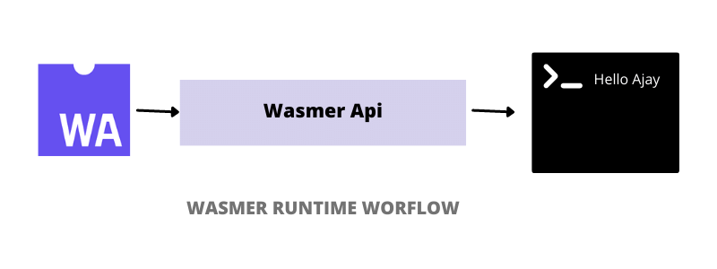

# WebAssembly outside of Browser




As of now we all familiar with NodeJS, which is JavaScript runtime, that means Node.js help us to run JavaScript outside of browser, likewise to run WebAssembly
outside of browser there are few runtime such as [Wasmer](https://wasmer.io/) and  [Wasmtime](https://wasmtime.dev/) which help us to run WebAssembly outside browser.

### Prerequisites
- An interface to access system resources such as [WASI](https://wasi.dev/)
- A runtime to which also have support for above interface and C/C++/Rust to wasm compiler


## 


<center> System Interface for webAssembly</center>

</br>
To run WebAssembly outside of the browser we need a way to talk to the system because we want support for features such as sockets, threads, files.
for that we need a system interface and there WebAssembly System Interface `   WASI   ` comes into play, which is a system interface for the WebAssembly platform.

## 


Wasmer is a WebAssembly runtime having support for system interface `  WASI  ` and  C/C++/Rust's to wasm compiler such as Emscripten, Clang, Rust, Clang etc.



### Features of Wasmer

- Secure by default. No file, network, or environment access, unless explicitly enabled.
- Supports WASI and Emscripten out of the box.
- Fast. Run WebAssembly at near-native speeds.
- Embeddable in multiple programming languages
- Compliant with latest WebAssembly Proposals (SIMD, Reference Types, Threads, ...)


### Installation
To install `Wasmer runtime` run the following command
```
curl https://get.wasmer.io -sSfL | sh
```

### Serving `WASM` file
```
wasmer run test.wasm
```


### Examples

-  [C Examples](./cWasm)
  - [Performance Time](./cWasm/performanceTime.c) for portability check</br>
  A program to calculate total time taken to count 1M.
- [Rust Examples](./rustWasm)
  - [Simple Hello Program](./rustWasm/hello)
