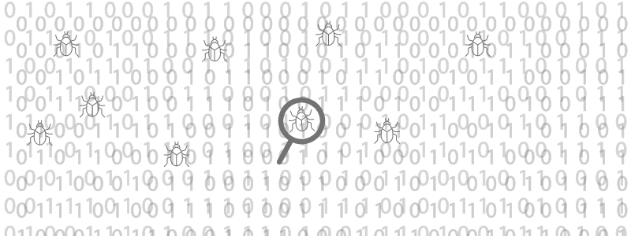
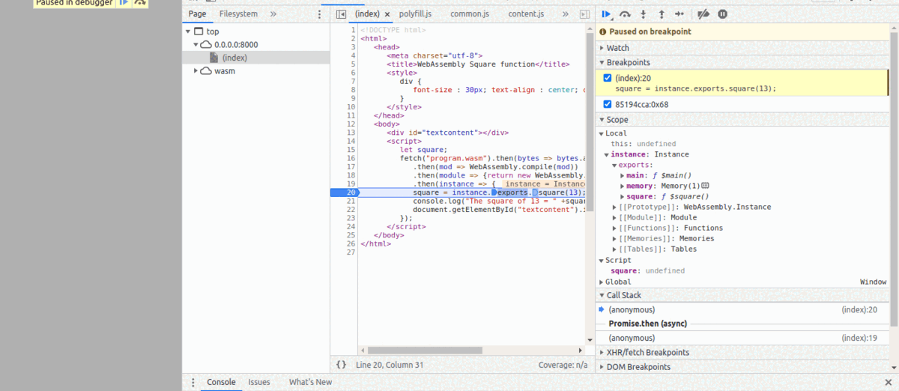

# Debugging


</br>
Debugging is the process of fixing a bug in the software, it also refers to identifying, analyzing and removing errors. This process begins after the software fails to execute properly and concludes by solving the problem and successfully testing the software.

### Why do we need Debugging?
The process of debugging begins as soon as we start coding a software and then  it continues in successive stages as code is combined with other units of programming to form a software product.

### Benefits of debugging

- Debugging allows earlier detection of an error that makes a stress-free development process of software.
- Debugging provides maximum useful information about data structures and allows easy interpretation.
- Through debugging the developer can avoid complex one-use testing code to save time in software development.

## Debugging Strategies
There can be many strategies to start debugging, some of them can be described as such:

- First of all we need to understand the system in depth because that helps us to construct different representations of systems that are to be debugged.

- Backward analysis of the problem traces the program backward from the location of the failure message in order to identify the region of faulty code for that we need to study the region of defect thoroughly to find the cause of defects.

- Forward analysis of the program involves tracking the program forward using `Breakpoints` or `print` statements at different points in the program. It is important to focus on the region where the wrong outputs are obtained.


### Example:



Let a Simple C program to compute square of a number:

```
#include<stdio.h>
int square(int n) {
  return n*n;
}
int main() {
  return 0;
}
```

The wasm code (text format) generated through the above program using [Wasm Fiddle](https://wasdk.github.io/WasmFiddle//) which is an online compiler to convert our code to WebAssembly, is as such:

```
(module
 (table 0 anyfunc)
 (memory $0 1)
 (export "memory" (memory $0))
 (export "square" (func $square))
 (export "main" (func $main))
 (func $square (; 0 ;) (param $0 i32) (result i32)
  (i32.mul
   (get_local $0)
   (get_local $0)
  )
 )
 (func $main (; 1 ;) (result i32)
  (i32.const 0)
 )
)
```

and the driver script

```
let square;
fetch("square.wasm").then(bytes => bytes.arrayBuffer())
   .then(mod => WebAssembly.compile(mod))
   .then(module => {return new WebAssembly.Instance(module) })
   .then(instance => {
   square = instance.exports.square(13);
   console.log("The square of 13 = " +square);
   document.getElementById("textcontent").innerHTML = "The square of 13 = " +square;
});
```


As we can see there in driver script we had put a break point and start the debugger and executing each and every line and it later it lead us to our WebAssembly module where it assign and computed the square input number and return output of that number and when the next it goes the next step it log out the message `The square of 13 = 169`.

There are many other ways to debug our program such as printing each and every step, that we will see in later demos.
