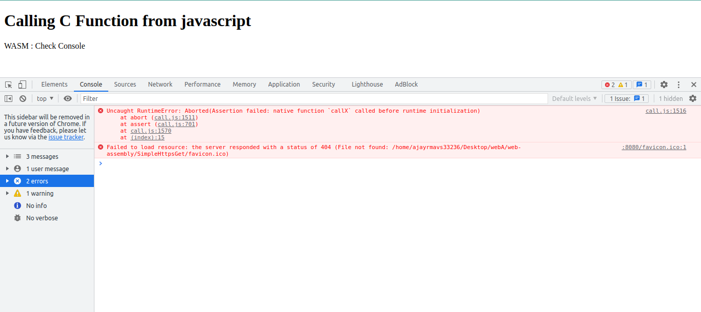
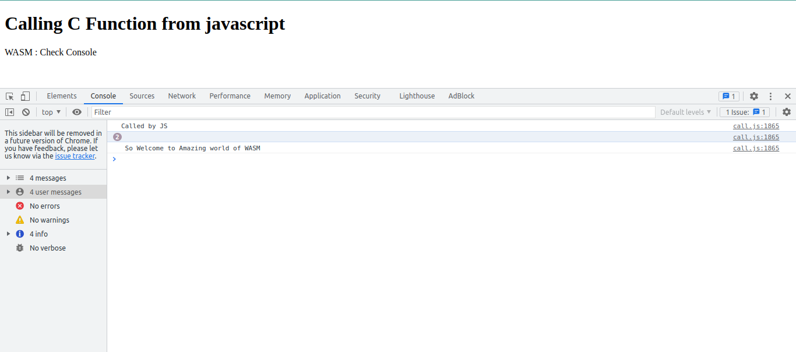
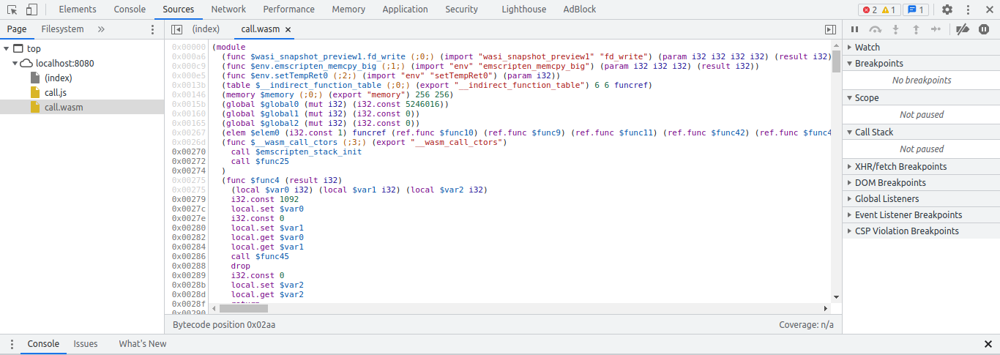
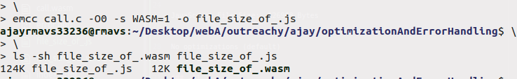
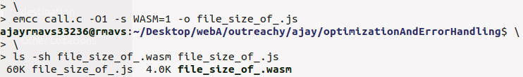
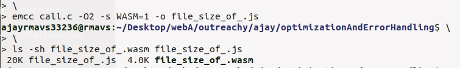
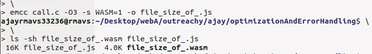

### Error before wasm get loaded and initialized

When we trying to access a function in wasm we might get an error like such:

### Solution
When we use JavaScript glue code to load `WASM modules` generated by Emscripten then we have to wait until it get loaded and initialized by JavaScript glue code, so if we try to access the function before its initialization then it will through an error as shown above. Solution to this is we have to use `  Module's  ` wasm utility `onRuntimeInitialized`, which will get executed after `wasm module` get loaded and ready to be used. and the result will look like this:

WASM loaded by JavaScript Glue code

## Code optimizations
When we compile our code using Emscripten the JavaScript Glue code and wasm file are a bit large and according to Emscripten they are default compiled version, to load WebAssembly module fast it provide many level of optimization `to reduce file size` and they are as such:

### -00

JavaScript File Size:  124k  
WASM file Size:        12k  

No optimizations (default)

### -01

JavaScript File Size:  60k  
WASM file Size:        4.0k  

Simple  optimizations, including asm.js, LLVM -O1 optimizations, and  no  runtime  assertions  or  C++  exception  catching.
> Optimizations  are  only  done when  compiling  to  JavaScript,  not  to  intermediate bitcode, *unless*   we  build   with   EMCC_OPTIMIZE_NORMALLY=1

### -02

JavaScript File Size:  20k  
WASM file Size:        4.0k  

As   -O1,   plus   the  relooper  (loop  recreation),  LLVM  -O2 optimizations, and  
-s ALIASING_FUNCTION_POINTERS=1

### -03

JavaScript File Size:  16k  
WASM file Size:        4.0k  

As  -O2,  plus  dangerous  optimizations  that  may  break   the generated code! This adds -s FORCE_ALIGNED_MEMORY=1  

-s DOUBLE_MODE=0 -s PRECISE_I64_MATH=0 --closure 1 --llvm-lto 1  

> This is not recommended at all. A better idea is to try each  of these  separately  on top of -O2 to see what works.

[Optimizations Ref.](https://sarata.com/manpages/emcc.1.html)
